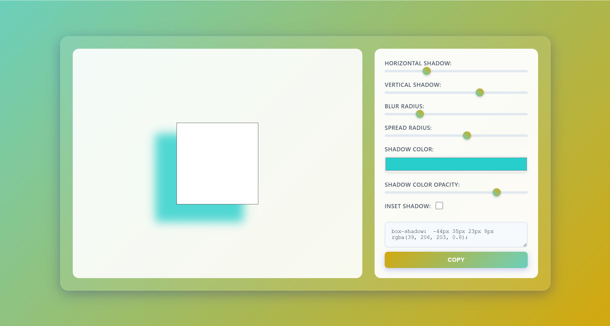

# 🧩 JavaScript 30 Projects in 30 Days

This repository contains my personal implementation of the **[JavaScript 30 Projects in 30 Days - Course for Beginners](https://www.udemy.com/course/javascript-30-projects-in-30-days-course-for-beginners/?couponCode=KEEPLEARNING)** on Udemy.

Each folder represents a small hands-on project built using **HTML, CSS, and Vanilla JavaScript**, designed to strengthen core front-end development skills.

---

## 🚀 Overview

This course focuses on **practical JavaScript projects** to help understand:
- DOM manipulation  
- Event handling  
- CSS integration with JS  
- Interactive UI components  
- Logic and problem-solving skills  

Every project is built from scratch without using any external frameworks.

---

## 🗂️ Project Directory

| No | Project Name | Live / Folder Link |
|----|---------------|--------------------|
| 00 | [All Projects](https://github.com/HilmiSalsabilla/html-projects/tree/main/0-All) | Main dashboard of all projects |
| 01 | [Shake on Invalid Input](https://github.com/HilmiSalsabilla/html-projects/tree/main/1-Shake-on-Invalid-Input) | Input validation with shake animation |
| 02 | [Box Shadow Generator](https://github.com/HilmiSalsabilla/html-projects/tree/main/2-Box-Shadow-Generator) | Create and copy CSS shadow effects |
| 03 | [Notes Application](https://github.com/HilmiSalsabilla/html-projects/tree/main/3-Notes-Application) | Simple note-taking app with localStorage |
| 04 | [FD Calculator](https://github.com/HilmiSalsabilla/html-projects/tree/main/4-FD-Calculator) | Fixed deposit calculator |
| 05 | [Gradient Generator](https://github.com/HilmiSalsabilla/html-projects/tree/main/5-Gradient-Generator) | Generate and copy CSS gradient backgrounds |
| 06 | [BMI Calculator](https://github.com/HilmiSalsabilla/html-projects/tree/main/6-BMI-Calculator) | Body Mass Index calculator |
| 07 | [Tip Calculator](https://github.com/HilmiSalsabilla/html-projects/tree/main/7-Tip-Calculator) | Calculate restaurant tips easily |
| 08 | [Blob Maker](https://github.com/HilmiSalsabilla/html-projects/tree/main/8-Blob-Maker) | Generate blob shapes with CSS |
| 09 | [Basic Image Editor](https://github.com/HilmiSalsabilla/html-projects/tree/main/9-Basic-Image-Editor) | Basic image filters and adjustments |
| 10 | [Input Character Counter](https://github.com/HilmiSalsabilla/html-projects/tree/main/10-Input-Character-Counter) | Count text input characters |
| 11 | [Image Slider](https://github.com/HilmiSalsabilla/html-projects/tree/main/11-Image-Slider) | Simple image carousel |
| 12 | [Day of the Week](https://github.com/HilmiSalsabilla/html-projects/tree/main/12-Day-of-the-Week) | Find the weekday from a date |
| 13 | [Live Word Counter](https://github.com/HilmiSalsabilla/html-projects/tree/main/13-Live-Word-Counter) | Real-time word and character count |
| 14 | [Video Slider](https://github.com/HilmiSalsabilla/html-projects/tree/main/14-Video-Slider) | Video carousel using JS |
| 15 | [Get Unicode Value](https://github.com/HilmiSalsabilla/html-projects/tree/main/15-Get-Unicode-Value) | Display Unicode of characters |
| 16 | [Dictionary Application (EN)](https://github.com/HilmiSalsabilla/html-projects/tree/main/16-Dictionary-Application-EN) | English word definitions API app |
| 17 | [Dictionary Application (ID)](https://github.com/HilmiSalsabilla/html-projects/tree/main/17-Dictionary-Application-ID) | Indonesian dictionary version |
| 18 | [Paragraph Generator](https://github.com/HilmiSalsabilla/html-projects/tree/main/18-Paragraph-Generator) | Random paragraph generator |
| 19 | [CSS Changer](https://github.com/HilmiSalsabilla/html-projects/tree/main/19-CSS-Changer) | Modify CSS properties dynamically |
| 20 | [Robot Joke Generator](https://github.com/HilmiSalsabilla/html-projects/tree/main/20-Robot-Joke-Generator) | Fetch random jokes from an API |
| 21 | [Star Rating](https://github.com/HilmiSalsabilla/html-projects/tree/main/21-Star-Rating) | Interactive rating component |
| 22 | [Generate Random Password](https://github.com/HilmiSalsabilla/html-projects/tree/main/22-Generate-Random-Password) | Random password generator |
| 23 | [Random Number Generator](https://github.com/HilmiSalsabilla/html-projects/tree/main/23-Random-Number-Generator) | Simple number generator |
| 24 | [Prime / Non-Prime Checker](https://github.com/HilmiSalsabilla/html-projects/tree/main/24-Prime-Non-Prime-Number) | Determine if a number is prime |
| 25 | [Counter Application](https://github.com/HilmiSalsabilla/html-projects/tree/main/25-Counter-Application) | Increment/decrement counter |
| 26 | [Age Calculator](https://github.com/HilmiSalsabilla/html-projects/tree/main/26-Age-Calculator) | Calculate exact age from date of birth |
| 27 | [Date & Time Widget](https://github.com/HilmiSalsabilla/html-projects/tree/main/27-Date-Time-Widget) | Digital clock widget |
| 28 | [Advanced Image Carousel](https://github.com/HilmiSalsabilla/html-projects/tree/main/28-Advance-Image-Carousel-Application) | Enhanced responsive carousel |
| 29 | [Code Editor](https://github.com/HilmiSalsabilla/html-projects/tree/main/29-Code-Editor) | Mini online code editor |
| 30 | [Poll System](https://github.com/HilmiSalsabilla/html-projects/tree/main/30-Poll-System) | Voting system with result bar |
| 31 | [Cash Calculator (Rupee)](https://github.com/HilmiSalsabilla/html-projects/tree/main/31-Cash-Calculator-Rupee) | Indian cash denomination calculator |
| 32 | [Cash Calculator (Rupiah)](https://github.com/HilmiSalsabilla/html-projects/tree/main/32-Cash-Calculator-IDN) | Indonesian version of cash calculator |

---

## 🖼️ Project Preview Gallery

Here’s a visual snapshot of some featured projects 👇  

  
  
  
  

  
  
  
  

> 🗒️ All previews are stored inside `/assets/previews/` for easy update or replacement.

---

## 💡 Tech Stack
- **HTML5**
- **CSS3 (Flexbox, Grid, Gradients, Animations)**
- **JavaScript (ES6)**

---

## 🧠 Key Learnings
- DOM traversal and manipulation  
- Event listeners and user interaction  
- Fetch API and JSON handling  
- Responsive UI and component styling  
- LocalStorage for data persistence  

---

## 🌙 Dashboard Theme
The project dashboard features a **Maroon-inspired professional theme** with a **Dark/Light mode toggle**, designed to resemble a modern developer control panel.

---

## 🧑‍💻 Author
**Hilmi Salsabilla**  
📎 [GitHub Profile](https://github.com/HilmiSalsabilla)

---

## 🪄 Acknowledgement
Special thanks to **[Udemy](https://www.udemy.com/)** and the instructor of *JavaScript 30 Projects in 30 Days* for providing hands-on, project-based learning ([Vijay Kumar](https://www.udemy.com/user/vijay-kumar-4865/)).

---

> ⭐ If you find this repository useful, feel free to star it — it helps motivate continued learning and improvement!
